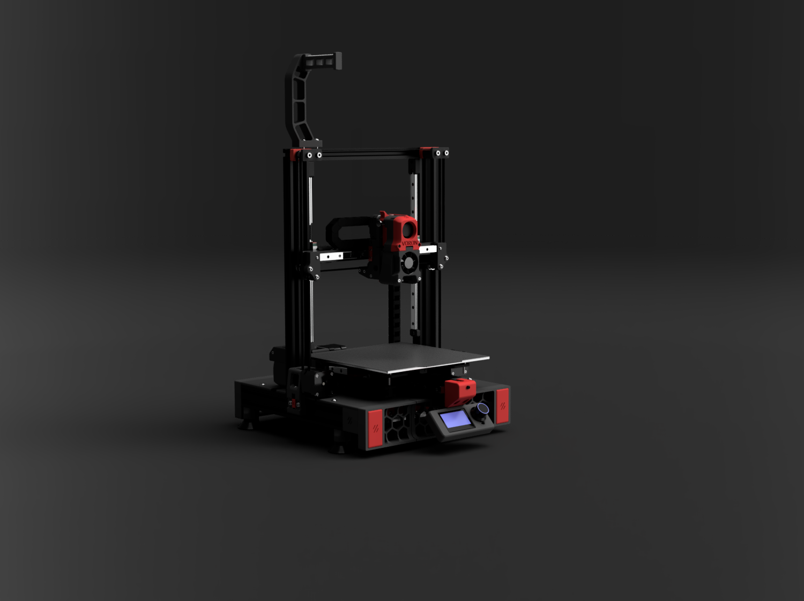
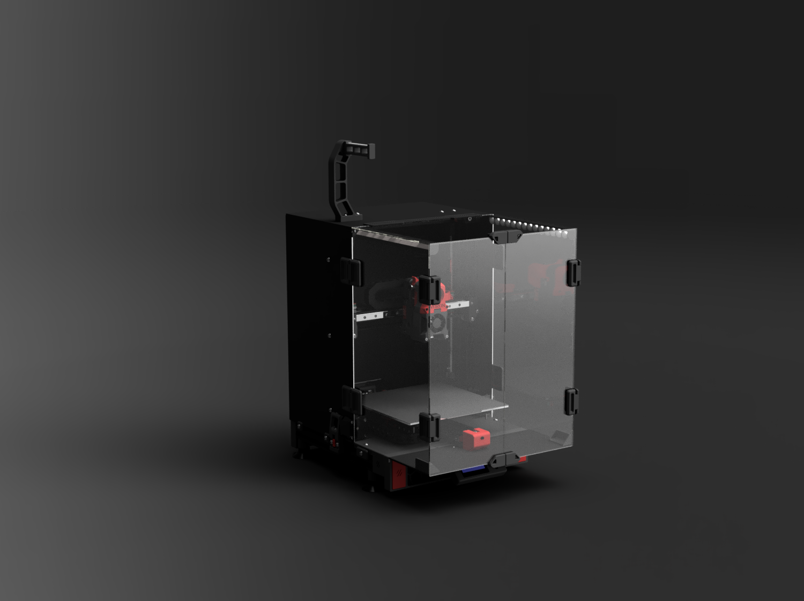

#  Ender 3 Pro/V2 to Switchwire Conversion
This is an attempt to adapt the Switchwire design and mechanic components to a much different base (Ender 3 Pro/V2), without major sacrifice in terms of aesthetics and function. Although the parts are adapted to Ender's frame, they are still designed according to Voron's design guidelines and principles.

## Overview
- This mod is using several key components from the Ender 3 Pro/V2, while providing a coreXZ capability. The highlights of this include:
1. The frame is the stock Ender 3 Pro/V2.
2. The electronics are based around the original Switchwire scheme, however, the Ender 3 Pro/V2 24V power supply is used. All electronics are mounted below the deck, as per the original Switchwire design, while the Mini12864 LCD screen has been used as standard.
3. The deck can be easily printed in 4 sections.
4. The XZ is modified for the 2020/2040 extrusion dimensions, while Gantry preserves the 300mm rail, used in the original Switchwire (in an attempt to keep all rails in common dimensions).
5. The Y axis is using 2 rails. This makes the Y more stable, while it simplifies the Y belt routing through the extrustion. Bed springs are replaced with spacers (the spacers come off the Ender 3 Pro/V2 V-wheels).  With the bed mesh probing, this seems like a better approach than worrying about the bed changing positions if the knobs rotate/get loosened.
6. The Ender 3 Pro/V2 motors can be reused if you can pull of the gears.
7. The design incorporates the original enclosure and is extending the side extrusions for 40mm (for aesthetic and functionality purposes).

## Images / CAD
STEP and .f3d files are included, along with images of the conversion.

## DXF Files
soon

## BOM
A BOM has been added that is based on the baseline Switchwire. This will not be perfect as the Ender 3's get a lot of mods by their owners. It should help with most of the key items to make the MOD. 

## Config
Phalanx and Lord Derpson have shared their printer.cfg files (with the SKR E3 Mini V2 as a base)

## STL Files
All files are adjusted for the 2020/2040/4040 extrusion dimensions so it's vital THAT YOU DON'T MIX parts from this and original Switchwire. You only need the "/X_Carriage" .stl files from there, as there is no change in that.

